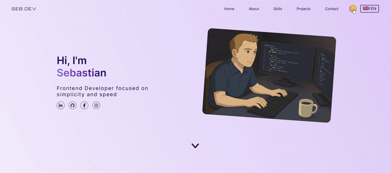
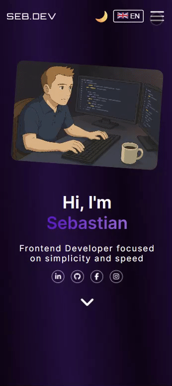
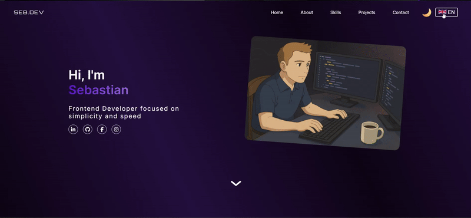
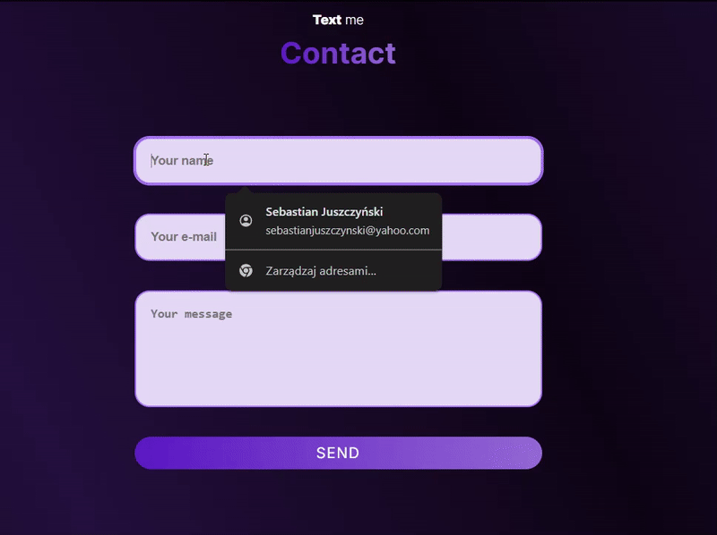

# Personal Portfolio (React Edition) 🚀

[Live Demo](https://sebastianjuszczynski.github.io/Portfolio-react/)

A modern, professional, and fully responsive **portfolio website** built with React.js, styled-components, and the latest frontend tools.  
This project is a rewrite of my vanilla JS portfolio — designed as a showcase of current web development skills, code quality, and UX best practices.

---

## ✨ Features

- ⚛️ **React 19** + functional components & hooks
- 💅 **Styled-components** — dynamic, modular CSS-in-JS
- 🌗 **Light / Dark mode** (saved in localStorage, with smooth transitions)
- 🌍 **Language switcher (EN/PL)** with Context API & i18n folder
- 📱 **Mobile-first design**, fully responsive
- 🚀 **Framer Motion / GSAP animations** for engaging UX
- 🧩 **Reusable component architecture**
- 📝 **Contact form** with live validation and user feedback
- 🧑‍🦯 **Accessible**: skip link, keyboard nav, aria-labels, semantic HTML
- ⏳ **Code splitting** & **lazy loading** for speed
- 📈 **Testing:** Vitest + React Testing Library + Playwright e2e tests
- 🔬 **Lint-staged, ESLint, Prettier, Husky** for top code quality
- 📝 Ready for easy extension with new sections or projects!

---

## 🛠️ Tech Stack

- **Core:** React 19, Vite
- **Styling:** styled-components
- **Animations:** framer-motion, gsap
- **Icons:** @fortawesome/react-fontawesome
- **Testing:** Vitest, React Testing Library, Playwright
- **Linting/Formatting:** ESLint, Prettier, Husky, lint-staged
- **Deployment:** GitHub Pages via gh-pages
- **Other:** vite-plugin-svgr (SVG as React components), hamburger-react (menu), localStorage

---

## 📁 Project Structure
```
src/
├── assets/ # Images, icons, video
├── components/ # Main sections (About, Contact, Hero, Footer, etc.)
│ ├── common/ # Reusable UI elements (headers, animations, etc.)
├── hooks/ # Custom React hooks
├── i18n/ # Language files (Context API) / translation logic
├── styles/ # Global styles, themes, resets
├── tests/ # Unit and integration tests
├── App.jsx # Root component
├── main.jsx # Entry point
public/
└── ... # Favicon, static files, etc.
```

---

## 🚦 Quick Start

1. **Clone the repo:**
    ```bash
    git clone https://github.com/sebastianjuszczynski/portfolio-react.git
    cd portfolio-react
    ```

2. **Install dependencies:**
    ```bash
    npm install
    # or
    yarn
    ```

3. **Run locally (development):**
    ```bash
    npm run dev
    # or
    yarn dev
    ```

4. **Run tests:**
    ```bash
    npm test        # all unit/integration tests (Vitest)
    npm run coverage
    npm run test:watch
    npx playwright test  # for e2e tests
    ```

5. **Lint & format:**
    ```bash
    npm run lint     # check linting (ESLint + Prettier)
    ```

6. **Build for production:**
    ```bash
    npm run build
    ```

7. **Deploy to GitHub Pages:**
    ```bash
    npm run deploy
    ```

---

## 📸 Screenshots / Demo
### 🌙 Theme toggle (Light / Dark)

### 📱 Mobile menu animation

### 🌍 Language switch (EN/PL)

### ✉️ Contact form with validation

### 🧝‍♂️ Animations

---

## 🤔 Why This Project?

- **Demonstrates real-world skills**: modern React (hooks, context, router, lazy), styled-components, modular code
- **Production-ready structure** — can be extended to blog, shop, dashboard etc.
- **Attention to accessibility**: skip links, keyboard support, aria labels
- **Testing**: unit + integration + E2E = ready for professional environments
- **Full English & Polish language support** (Context + i18n)
- **Perfect for portfolio and job applications** — code is clean, readable, and documented

---

## 📝 Known Issues & Roadmap

- [ ] Add more integration/E2E tests for form and menu
- [ ] Refactor global state to Redux Toolkit if project grows
- [ ] Add animations for project cards
- [ ] Add "blog" or "case study" section

---

## 📃 License

MIT — free to use, fork, and adapt.

---

> **Looking for a React/Frontend Developer?**  
• [LinkedIn](https://www.linkedin.com/in/sebastian-juszczynski-52982a243/) 
• [GitHub](https://github.com/sebastianjuszczynski)

